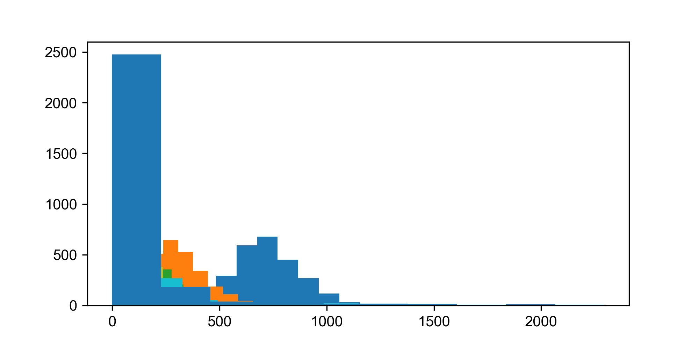
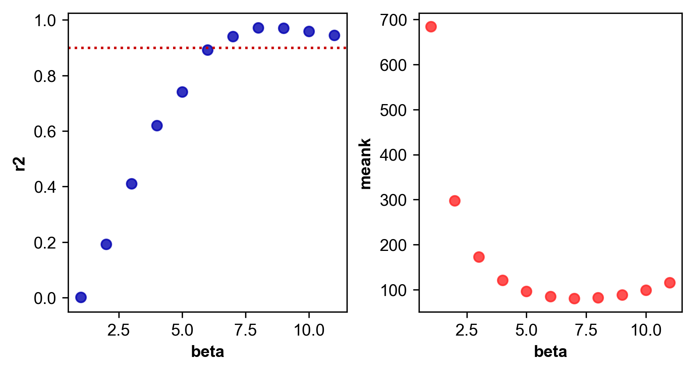
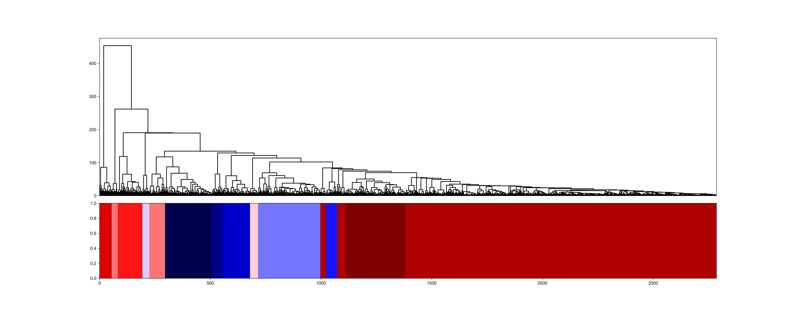
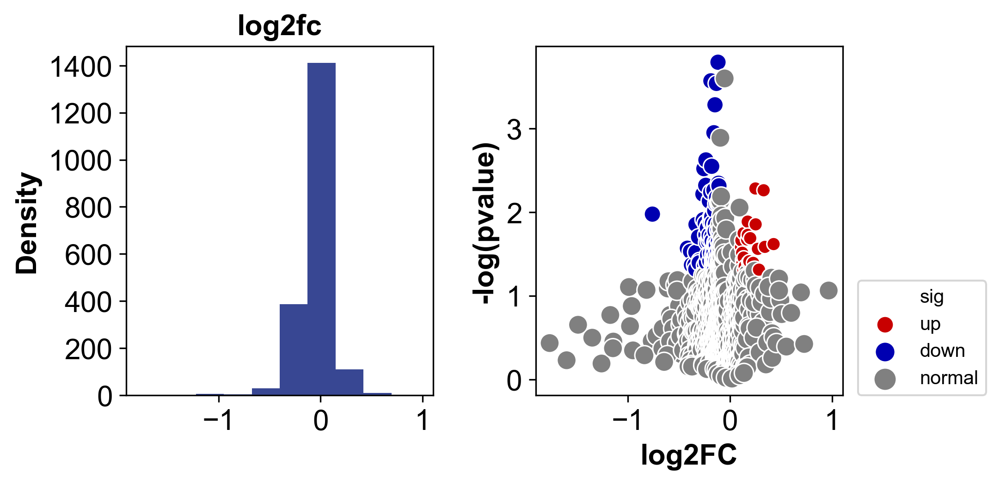
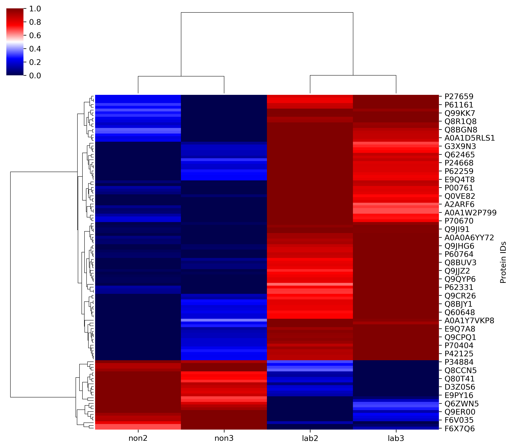
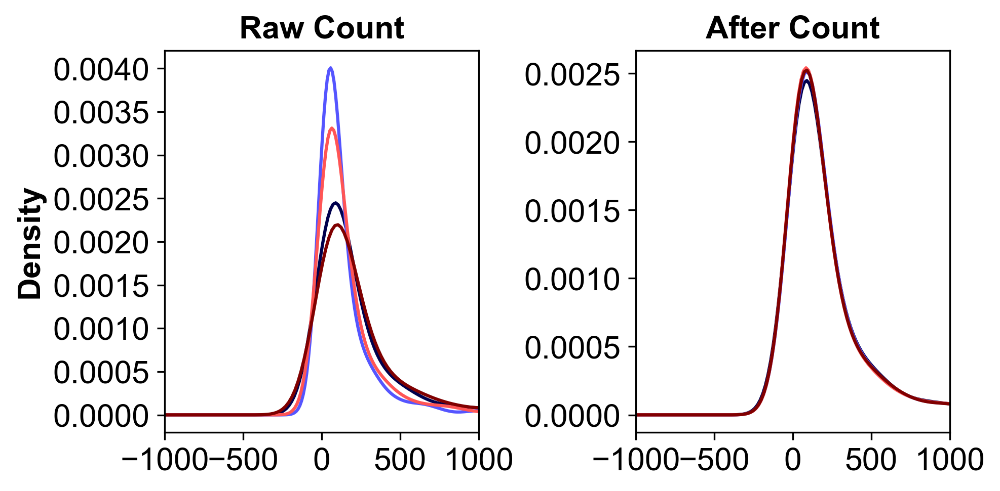
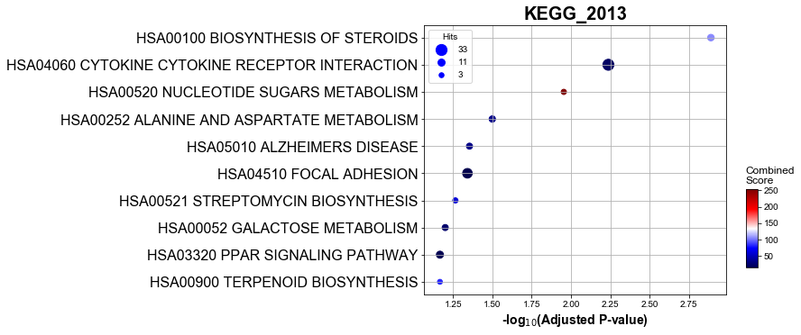
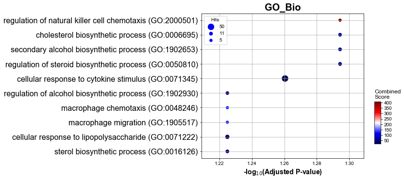
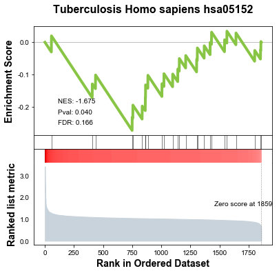

# Pyomic - framework for omics

[](https://www.tidyverse.org/lifecycle/#maturing)
[](https://img.shields.io/appveyor/build/gruntjs/grunt)
[](https://img.shields.io/apm/l/vim-mode)


**The first python library for omics !**

## Where to get it

Binary installers for the latest released version are available at the pypi

    #PyPI
    #pip install Pyomic

## Dependencies

- numpy
- pandas
- matplotlib
- sklearn
- scipy
- networkx
- datetime
- seaborn
- ERgene
- os

See the full installation instructions for minimum supported versions of required, recommended and optional dependencies


## Functions available

| Functions     | Description |
| ---------------- | ------------ |
| Trans_corr_matrix | Calculate the correlation adjacent matrix (direct and indirect) (scale-free network) |
|Select_module	|Select gene module from correlation adjacent matrix |
|Analysis_cocharacter	|Calculate gene and trait correlation matrix |
|Find_DEG	|Screening Differentially expressed genes/proteins |
|ID_mapping	|Probe matching conversion |
|Enrichment_KEGG	|Gene enrichment analysis of KEGG |
|Enrichment_GO	|Gene enrichment analysis of GO |
|Enrichment_GSEA	|Gene Set Enrichment Analysis |
|Plot_GSEA	|Draw the result figure of GSEA |
|Plot_gene_expression	|Draw target gene expression in matrix |
|Density_norm | The batch effect of samples was eliminated and the data was normalized |
|ID_mapping | Universal probe matching conversion gene ID |

## Input data frame

### Gene expression matrix

| gene_name | sample1   | sample2    | ...  |
| :-------- | --------- | ---------- | ---- |
| Rbbp7     | 3.199028  | 0.000000   | ...  |
| Pafah1b2  | 61.878472 | 14.433681  | ...  |
| Col1a2    | 39.829861 | 100.621528 | ...  |
| Pimreg    | 12.568750 | 17.022917  | ...  |

### Character matrix

| Sample  | character_1 | character_2 | character_3 | character_4 |
| ------- | ----------- | ----------- | ----------- | ----------- |
| sample1 | 38          | 10.5        | 3.81        | 2.78        |
| sample2 | 33.5        | 10.8        | 1.7         | 2.05        |
| ...     | 33.9        | 10          | 1.29        | 1.67        |

## Function sample

All data could be found in Sample file

### Screening for gene co-expression modules

#### Input

```python
import Pyomic
%matplotlib inline
import pandas as pd

#Input data
data=pd.read_csv('LiverFemale3600.csv')
data.dropna(inplace=True)
data.set_index(data.columns[0],inplace=True)
data.head()

#Identification of similar co-expression gene/protein module
table=Pyomic.Trans_corr_matrix(data,
                      method='pearson')
#Select module from actual corr matrix
module=Pyomic.Select_module(table,
                  linkage_method='ward',
                  minClusterSize=30,
                  deepSplit=2,
                 )
```

#### Output

```python

...correlation coefficient matrix is being calculated
...direction correlation have been saved
...calculate time 0:00:08.472347
...indirect correlation matrix is being calculated
...indirection correlation have been saved
...calculate time 0:00:00.385973
...soft_threshold is being calculated
...appropriate soft_thresholds: 6.0
...distance have being calculated
...geneTree have being calculated
...dynamicMods have being calculated
..cutHeight not given, setting it to 448.9691031625521  ===>  99% of the (truncated) height range in dendro.
..done.
...total: 12
```

##### table

| substanceBXH |  MMT00000044 |  MMT00000046 |  MMT00000051 |  MMT00000080 |  MMT00000102 |
| -----------: | -----------: | -----------: | -----------: | -----------: | -----------: |
| substanceBXH |              |              |              |              |              |
|  MMT00000044 | 1.000000e+00 | 1.197504e-05 | 4.341150e-06 | 3.256149e-09 | 2.850266e-05 |
|  MMT00000046 | 1.197504e-05 | 1.000000e+00 | 1.492743e-01 | 1.558217e-08 | 1.980153e-01 |
|  MMT00000051 | 4.341150e-06 | 1.492743e-01 | 1.000000e+00 | 5.665705e-08 | 7.847442e-07 |
|  MMT00000080 | 3.256149e-09 | 1.558217e-08 | 5.665705e-08 | 1.000000e+00 | 1.121383e-06 |
|  MMT00000102 | 2.850266e-05 | 1.980153e-01 | 7.847442e-07 | 1.121383e-06 | 1.000000e+00 |

##### module

|  ivl | module | name |             |
| ---: | -----: | ---: | ----------- |
|    0 |     52 |   10 | MMT00001732 |
|    1 |    702 |   10 | MMT00021266 |
|    2 |   1693 |   10 | MMT00051462 |
|    3 |   2735 |   10 | MMT00081299 |
|    4 |    680 |   10 | MMT00020632 |

##### Plot








### Calculate the correlation between gene modules and characters

#### Input

```python
#Correlation analysis between gene modules and traits
cha=pd.read_csv('character.csv')
cha.set_index(cha.columns[0],inplace=True)
co_character(data,
             character=cha,
             module=module)
```

#### Output

```python
...PCA analysis have being done
...co-analysis have being done
```

##### co-analysis matrix

|      | weight_g | length_cm |   ab_fat | other_fat |
| ---: | -------: | --------: | -------: | --------- |
|    1 | 0.000579 |  0.130891 | 0.025539 | 0.208714  |
|    2 | 0.370098 |  0.084585 | 0.295754 | 0.351596  |
|    3 | 0.285441 |  0.023763 | 0.281423 | 0.213187  |
|    4 | 0.150483 |  0.122483 | 0.205454 | 0.047039  |
|    5 | 0.244029 |  0.152480 | 0.288425 | 0.038686  |
|    6 | 0.005157 |  0.067767 | 0.027740 | 0.002952  |
|    7 | 0.007820 |  0.058246 | 0.027043 | 0.138332  |
|    8 | 0.299864 |  0.143134 | 0.273537 | 0.134064  |
|    9 | 0.179886 |  0.137660 | 0.230412 | 0.029496  |
|   10 | 0.203550 |  0.031582 | 0.146253 | 0.207015  |
|   11 | 0.676308 |  0.173676 | 0.549321 | 0.534850  |
|   12 | 0.577942 |  0.111693 | 0.495211 | 0.447296  |

##### Plot


### Screening for differential expression gene

#### Input

```python
genedata=pd.read_csv('testa.csv')
genedata=genedata.dropna()
genedata=genedata.set_index(genedata.columns[0])
res1=find_DEG(genedata,eg=['lab2','lab3'],cg=['non2','non3'],fold_change=0.1,cmap="seismic")
```

#### Output

```
up: 25
down: 96
```

##### result matrix

| Protein IDs |   pvalue | FoldChange | log(pvalue) |    log2FC |    sig |
| ----------: | -------: | ---------: | ----------: | --------: | -----: |
|      F6ZLC6 | 0.589270 |   3.036977 |    0.229686 | -1.602636 | normal |
|  A0A1L1SQV7 | 0.316531 |   2.551495 |    0.499584 | -1.351343 | normal |
|      Q01149 | 0.367158 |   3.407940 |    0.435147 | -1.768900 | normal |
|      Q5RIU1 | 0.221762 |   2.809577 |    0.654113 | -1.490353 | normal |
|      Q3V0W6 | 0.644673 |   2.395504 |    0.190661 | -1.260329 | normal |

##### Plot






### Plot gene expression

#### input

```python
Pyomic.Plot_gene_expression(genedata,['P27659','P61161'],eg=['lab2','lab3'],cg=['non2','non3'])
```

#### Output

```python
0.03227859464846009 *
0.04396375161005844 *
```

##### Plot


### ID_mapping

#### Input

```python
data=pd.read_csv('LiverFemale3600.csv')
data=data.set_index(data.columns[0])

mapping=pd.read_csv('GeneAnnotation.csv')
data1=Pyomic.ID_mapping(data.dropna(),mapping,'substanceBXH','gene_symbol')
```

##### matrix

| substanceBXH |     F2_2 |    F2_3 |     F2_14 |   F2_15 |    F2_19 |
| -----------: | -------: | ------: | --------: | ------: | -------: |
|  MMT00000044 | -0.01810 |  0.0642 |  0.000064 | -0.0580 |  0.04830 |
|  MMT00000046 | -0.07730 | -0.0297 |  0.112000 | -0.0589 |  0.04430 |
|  MMT00000051 | -0.02260 |  0.0617 | -0.129000 |  0.0871 | -0.11500 |
|  MMT00000076 | -0.00924 | -0.1450 |  0.028700 | -0.0439 |  0.00425 |
|  MMT00000080 | -0.04870 |  0.0582 | -0.048300 | -0.0371 |  0.02510 |

#### Output

|               |    F2_2 |    F2_3 |     F2_14 |    F2_15 | F2_19    |
| ------------: | ------: | ------: | --------: | -------: | -------- |
| 1700007N18Rik | -0.0181 |  0.0642 |  0.000064 | -0.05800 | 0.04830  |
|         Mast2 | -0.0773 | -0.0297 |  0.112000 | -0.05890 | 0.04430  |
|       Ankrd32 | -0.0226 |  0.0617 | -0.129000 |  0.08710 | -0.11500 |
|          Ldb2 | -0.0487 |  0.0582 | -0.048300 | -0.03710 | 0.02510  |
|          Rdhs |  0.1760 | -0.1890 | -0.065000 | -0.00846 | -0.00574 |

### Density norm

#### Input

```python
data=pd.read_csv('test.csv')
data=data.set_index(data.columns[0])
#Eliminate the sample batch effect
normdata=Pyomic.Density_norm(data,
                      depth=2,
                      legend=False,
                      norm_by=0,
                      xlim=1000,
                     )
```

##### Raw Count

|      genename |           |            |           |           |
| ------------: | --------: | ---------: | --------: | --------: |
|         Rbbp7 |  3.199028 |   0.000000 |  0.000000 |  1.210764 |
|      Pafah1b2 | 61.878472 |  14.433681 | 11.759722 | 20.620139 |
|        Col1a2 | 39.829861 | 100.621528 | 14.347917 | 46.003472 |
|        Pimreg | 12.568750 |  17.022917 |  5.023264 |  8.711806 |
| 1700022I11Rik |  4.738889 |   0.000000 |  0.000000 |  2.273854 |

 

#### Output

```python
calculate time:3.52s
['Atp1a3', 'Sptan1', 'Sptbn1', 'Pkm', 'Map1a', 'Dync1h1', 'Ckb', 'Ina', 'Ank2', 'Cltc', 'Bsn', 'Hsp90ab1', 'Camk2a', 'Atp1a1', 'Stxbp1', 'Nefm', 'Dnm1', 'Slc1a2', 'Camk2b', 'Mbp']
```

##### After Count

|      genename |           |            |           |           |
| ------------: | --------: | ---------: | --------: | --------: |
|         Rbbp7 |  3.199028 |   0.000000 |  0.000000 |  1.053359 |
|      Pafah1b2 | 61.878472 |  22.991400 | 15.323370 | 17.939428 |
|        Col1a2 | 39.829861 | 160.279962 | 18.695887 | 40.022815 |
|        Pimreg | 12.568750 |  27.115792 |  6.545506 |  7.579232 |
| 1700022I11Rik |  4.738889 |   0.000000 |  0.000000 |  1.978243 |

##### Plot




### KEGG Enrichment analysis

#### Input

```python
mol1=pd.read_csv('mol11.csv')
mol1=mol1.set_index(mol1.columns[0])
res1=Pyomic.enrichment_KEGG(mol1.index.dropna().tolist(),
                            gene_sets=['KEGG_2013'],
                            cutoff=0.5)
res1.head()
```

#### Output

##### Matrix

|      |  Gene_set |                                            Term | Overlap |  P-value | Adjusted P-value | Old P-value | Old Adjusted P-value | Odds Ratio | Combined Score | Genes                                             |
| ---: | --------: | ----------------------------------------------: | ------: | -------: | ---------------: | ----------: | -------------------: | ---------: | -------------: | ------------------------------------------------- |
|    0 | KEGG_2013 |               HSA00100 BIOSYNTHESIS OF STEROIDS |    9/24 | 0.000008 |         0.001288 |           0 |                    0 |   9.026988 |     105.882816 | FDPS;IDI1;SQLE;NSDHL;PMVK;MVD;DHCR7;LSS;SC4MOL    |
|    1 | KEGG_2013 | HSA04060 CYTOKINE CYTOKINE RECEPTOR INTERACTION |  33/257 | 0.000072 |         0.005783 |           0 |                    0 |   2.234797 |      21.308560 | CSF3R;FLT1;FLT4;IL1RAP;TNF;CSF2RA;EGFR;CXCL5;I... |
|    2 | KEGG_2013 |           HSA00520 NUCLEOTIDE SUGARS METABOLISM |     4/6 | 0.000208 |         0.011109 |           0 |                    0 |  29.990400 |     254.214946 | UGDH;GALE;GALT;UGP2                               |
|    3 | KEGG_2013 |       HSA00252 ALANINE AND ASPARTATE METABOLISM |    8/33 | 0.000791 |         0.031658 |           0 |                    0 |   4.807961 |      34.336695 | GOT1;GPT2;ASL;DLAT;AGXT;ASPA;CRAT;ASS1            |
|    4 | KEGG_2013 |                     HSA05010 ALZHEIMERS DISEASE |    7/28 | 0.001382 |         0.044221 |           0 |                    0 |   5.005346 |      32.956693 | C1QB;C1QA;BACE2;MME;CASP3;IL1B;TNF                |

##### Plot



### GO Enrichment analysis

#### Input

```python
mol1=pd.read_csv('mol11.csv')
mol1=mol1.set_index(mol1.columns[0])
res2=Pyomic.enrichment_GO(mol1.index.dropna().tolist(),
                            go_mode='Bio',
                            cutoff=0.5)
res2.head()
```


#### Output

##### Matrix

|      |                   Gene_set |                                              Term | Overlap |  P-value | Adjusted P-value | Old P-value | Old Adjusted P-value | Odds Ratio | Combined Score | Genes                                             |
| ---: | -------------------------: | ------------------------------------------------: | ------: | -------: | ---------------: | ----------: | -------------------: | ---------: | -------------: | ------------------------------------------------- |
|    0 | GO_Biological_Process_2018 | regulation of natural killer cell chemotaxis (... |     5/7 | 0.000018 |         0.050779 |           0 |                    0 |  37.518014 |     409.577482 | CCL7;CCL5;CCL4;CCL3;CCL2                          |
|    1 | GO_Biological_Process_2018 |     cholesterol biosynthetic process (GO:0006695) |   10/35 | 0.000039 |         0.050779 |           0 |                    0 |   6.019614 |      61.079222 | IDI1;FDPS;ACLY;SQLE;NSDHL;PMVK;MVD;DHCR7;LSS;A... |
|    2 | GO_Biological_Process_2018 | secondary alcohol biosynthetic process (GO:190... |   10/36 | 0.000051 |         0.050779 |           0 |                    0 |   5.787781 |      57.176042 | IDI1;FDPS;ACLY;SQLE;NSDHL;PMVK;MVD;DHCR7;LSS;A... |
|    3 | GO_Biological_Process_2018 | regulation of steroid biosynthetic process (GO... |   11/44 | 0.000063 |         0.050779 |           0 |                    0 |   5.018235 |      48.514795 | IDI1;FDPS;SQLE;BMP2;FASN;PMVK;MVD;DHCR7;FGFR4;... |
|    4 | GO_Biological_Process_2018 | cellular response to cytokine stimulus (GO:007... |  50/456 | 0.000086 |         0.054901 |           0 |                    0 |   1.875931 |      17.570898 | CSF3R;IL1RAP;TNF;CASP3;ITGAX;ANKRD1;TIMP1;LBP;... |

##### Plot



### GSEA Enrichment analysis

#### Input

```python
#result.csv file come from function(find_DEG)
result=pd.read_csv('result.csv')
result=result.set_index(result.columns[0])
res=Pyomic.enrichment_GSEA(result)
Pyomic.Plot_GSEA(res,0)
```

```python
res.res2d.sort_index().head()
```


#### Output

##### Matrix

|                                                         Term |        es |       nes |     pval |      fdr | geneset_size | matched_size |                                             genes |                                       ledge_genes |
| -----------------------------------------------------------: | --------: | --------: | -------: | -------: | -----------: | -----------: | ------------------------------------------------: | ------------------------------------------------: |
|                 AMPK signaling pathway Homo sapiens hsa04152 |  0.149409 |  0.762659 | 0.800000 | 0.899548 |          124 |           22 | TSC2;CPT1C;PCK2;PPP2R2A;PFKP;RHEB;RAB11B;PPP2C... | TSC2;CPT1C;PCK2;PPP2R2A;PFKP;RHEB;RAB11B;PPP2C... |
|                      Adherens junction Homo sapiens hsa04520 |  0.137068 |  0.717007 | 0.815385 | 0.898918 |           74 |           24 | RAC3;ACTN2;ACTN4;CTNND1;WASL;MLLT4;ACTG1;ACTN1... | RAC3;ACTN2;ACTN4;CTNND1;WASL;MLLT4;ACTG1;ACTN1... |
| Adrenergic signaling in cardiomyocytes Homo sapiens hsa04261 | -0.197193 | -1.635527 | 0.060606 | 0.189466 |          148 |           45 | GNAI2;PPP1CC;CACNA2D3;PPP2R2A;GNAS;PPP2CA;RYR2... | ADCY5;PRKCA;GNAI1;MAPK1;ATP2B2;AKT3;CACNA2D1;A... |
|                             Alcoholism Homo sapiens hsa05034 |  0.142452 |  0.932963 | 0.485294 | 0.890952 |          179 |           38 | H3F3A;GNG12;GNAI2;PPP1CC;GRIN1;GNG3;GNG5;HRAS;... | H3F3A;GNG12;GNAI2;PPP1CC;GRIN1;GNG3;GNG5;HRAS;... |
|    Aldosterone synthesis and secretion Homo sapiens hsa04925 | -0.314807 | -1.676686 | 0.000000 | 0.213195 |           81 |           19 | GNAS;PRKCG;ADCY5;PRKCA;CAMK1D;CALM3;GNAQ;CAMK2... | CALM3;GNAQ;CAMK2B;PLCB1;PDE2A;ITPR1;CAMK2A;PRK... |

##### Plot




