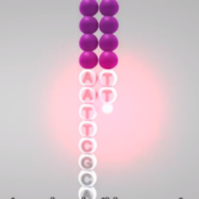

<div align="center">
  <a href="READMEM/README_CN.md">中文</a> | <a href="READMEM/README_ES.md">Español</a> | <a href="READMEM/README_JP.md">日本語</a> | <a href="READMEM/README_DE.md">Deutsch</a> | <a href="READMEM/README_FR.md">Français</a> | <a href="READMEM/README_KR.md">한국어</a>


|         |                                                                                                                                                  |
| ------- | ------------------------------------------------------------------------------------------------------------------------------------------------ |
| CI/CD   |  [![pre-commit.ci status][precommit-badge]][precommit-link]               |
| Docs    | [![Documentation Status][readthedocs-badge]][readthedocs-link] [![Preprint][preprint-badge]][preprint-link]                                            |
| Package | [![PyPI - Version][pypi-badge]][pypi-link] [![pypi download][pypi-download-badge]][pypi-download-link] [![Conda-forge badge][conda-forge-badge]][anaconda-link] [![Docker image][docker-badge]][docker-link] |
| Meta    | [![scverse-badge]][scverse-link] [![License][license-badge]][license-link] [![Star][star-badge]][star-link] [![Citations][citation-badge]][citation-link]           |


[precommit-badge]: https://github.com/Starlitnightly/omicverse/workflows/py310|py311/badge.svg
[precommit-link]:https://github.com/Starlitnightly/omicverse/
[readthedocs-badge]:https://readthedocs.org/projects/omicverse/badge/?version=latest
[readthedocs-link]:https://omicverse.readthedocs.io/en/latest/?badge=latest
[preprint-badge]: https://img.shields.io/badge/DOI-10.1038/s41467.024.50194.3-368650.svg
[preprint-link]: https://doi.org/10.1038/s41467-024-50194-3
        
        
[pypi-badge]: https://img.shields.io/pypi/v/omicverse
[pypi-link]: https://pypi.org/project/omicverse
[pypi-download-badge]:https://static.pepy.tech/badge/omicverse
[pypi-download-link]:https://pepy.tech/project/omicverse
[conda-forge-badge]: https://img.shields.io/conda/dn/conda-forge/omicverse?logo=Anaconda
[anaconda-link]: https://anaconda.org/conda-forge/omicverse
[docker-badge]: https://img.shields.io/badge/docker-image-blue?logo=docker
[docker-link]: https://img.shields.io/docker/pulls/starlitnightly/omicverse
[license-badge]: https://img.shields.io/badge/license-GNU-blue
[license-link]: https://img.shields.io/apm/l/vim-mode
[scverse-badge]: https://img.shields.io/badge/scverse-ecosystem-blue.svg?labelColor=yellow
[scverse-link]: https://scverse.org/
[star-badge]:https://img.shields.io/github/stars/Starlitnightly/omicverse
[star-link]:https://github.com/Starlitnightly/omicverse
[citation-badge]:https://citations.njzjz.win/10.1038/s41467-024-50194-3
        
        
[citation-link]:https://doi.org/10.1038/s41467-024-50194-3
        
        

</div>


**`OmicVerse`** is the fundamental package for multi omics included **bulk ,single cell and spatial RNA-seq** analysis with Python. For more information, please read our paper: [OmicVerse: a framework for bridging and deepening insights across bulk and single-cell sequencing](https://www.nature.com/articles/s41467-024-50194-3)

> [!IMPORTANT]
>
> **Star Us**, You will receive all release notifications from GitHub without any delay \~ ⭐️
>
> If you like **OmicVerse** and want to support our mission, please consider making a [💗donation](https://ifdian.net/a/starlitnightly) to support our efforts.

<details>
  <summary><kbd>Star History</kbd></summary>
  <picture>
    <source media="(prefers-color-scheme: dark)" srcset="https://api.star-history.com/svg?repos=Starlitnightly%2Fomicverse&theme=dark&type=Date">
    
  </picture>
</details>


## `1` [Introduction][docs-feat-provider]

**OmicVerse v2** is a unified Python project for modern transcriptomics and multi-omics analysis. It brings together bulk RNA-seq, single-cell, spatial transcriptomics, downstream visualization, model-based analysis, and AI-assisted workflows in one package and documentation system.

> [!NOTE]
> OmicVerse v2 is organized as a broader analysis platform rather than a single-method package. In addition to core analysis modules, it now includes agent-style workflows through **J.A.R.V.I.S.**, MCP-based tool serving for AI clients, and a growing documentation/tutorial system under `omicverse_guide`.


## `2` [Directory structure](#)

````shell
.
├── omicverse                  # Main Python package
├── omicverse_guide            # Documentation files
├── omicverse_web              # Web Analysis Platform
├── sample                     # Some test data
├── LICENSE
└── README.md
````

## `3` [General Getting Started](#)

OmicVerse can be installed via conda or pypi and you need to install `pytorch` at first. Please refer to the [installation tutorial](https://starlitnightly.github.io/omicverse/Installation_guild/) for more detailed installation steps and adaptations for different platforms (`Windows`, `Linux` or `Mac OS`).

You can use `conda install omicverse -c conda-forge` or `pip install -U omicverse` for installation.

Please checkout the documentations and tutorials at [omicverse page](https://starlitnightly.github.io/omicverse/) or [omicverse.readthedocs.io](https://omicverse.readthedocs.io/en/latest/index.html).


## `4` [J.A.R.V.I.S Getting Started](#)

### 4.1 OpenClaw 

OmicVerse provide an directly interact analysis with OpenClaw project. You can use

```bash
omicverse claw 'help me annotate the lung scrna-seq'
```

This module supported by `ov.Agent` function. And i think that will be convinent for you to analysis the anndata using OpenClaw. 

The full tutorial could be found at [here](https://omicverse.readthedocs.io/en/latest/Tutorials-llm/t_ov_agent_pbmc3k/)

### 4.2 MCP Server (Model Context Protocol)

OmicVerse provide an MCP server that exposes registered analysis tools to AI assistants (Claude Code, etc.) via the standard [Model Context Protocol](https://modelcontextprotocol.io/).


```bash
# Install with MCP dependencies
pip install -e "omicverse[mcp]"

# Start the server (stdio transport)
python -m omicverse.mcp        # or: omicverse-mcp
python -m omicverse.mcp --phase P0   # core pipeline tools only
```
The full tutorial could be found at [here](https://omicverse.readthedocs.io/en/latest/Tutorials-llm/t_mcp_guide/)

### 4.3 J.A.R.V.I.S Msg system

If you want to analysis the `AnnData` using Mobile Phone, maybe you can try 

```bash
# Install with jarvis dependencies
pip install "omicverse[jarvis]"

# Start to chat with JARVIS using telegram
omicverse jarvis --channel telegram --token "$TELEGRAM_BOT_TOKEN"
```
The full tutorial could be found at [here](https://omicverse.readthedocs.io/en/latest/Tutorials-jarvis/t_msg_bot_overview/)


## `4` [Data Framework and Reference](#)

The omicverse is implemented as an infrastructure based on the following four data structures.

<div align="center">
<table>
  <tr>
    <td> <a href="https://github.com/pandas-dev/pandas">pandas</a></td>
    <td> <a href="https://github.com/scverse/anndata">anndata</a></td>
    <td> <a href="https://github.com/numpy/numpy">numpy</a></td>
    <td> <a href="https://github.com/scverse/mudata">mudata</a></td>
  </tr>

</table>
</div>

---

The table contains the tools have been published 

<div align="center">
<table>

  <tr>
    <td align="center">Scanpy<br><a href="https://github.com/scverse/scanpy">📦</a> <a href="https://link.springer.com/article/10.1186/s13059-017-1382-0">📖</a></td>
    <td align="center">dynamicTreeCut<br><a href="https://github.com/kylessmith/dynamicTreeCut">📦</a> <a href="https://academic.oup.com/bioinformatics/article/24/5/719/200751">📖</a></td>
    <td align="center">scDrug<br><a href="https://github.com/ailabstw/scDrug">📦</a> <a href="https://www.sciencedirect.com/science/article/pii/S2001037022005505">📖</a></td>
    <td align="center">MOFA<br><a href="https://github.com/bioFAM/mofapy2">📦</a> <a href="https://genomebiology.biomedcentral.com/articles/10.1186/s13059-020-02015-1">📖</a></td>
    <td align="center">COSG<br><a href="https://github.com/genecell/COSG">📦</a> <a href="https://academic.oup.com/bib/advance-article-abstract/doi/10.1093/bib/bbab579/6511197?redirectedFrom=fulltext">📖</a></td>
    <td align="center">CellphoneDB<br><a href="https://github.com/ventolab/CellphoneDB">📦</a> <a href="https://www.nature.com/articles/s41586-018-0698-6">📖</a></td>
    </tr>

  <tr>
    <td align="center">AUCell<br><a href="https://github.com/aertslab/AUCell">📦</a> <a href="https://bioconductor.org/packages/AUCell">📖</a></td>
    <td align="center">Bulk2Space<br><a href="https://github.com/ZJUFanLab/bulk2space">📦</a> <a href="https://www.nature.com/articles/s41467-022-34271-z">📖</a></td>
    <td align="center">SCSA<br><a href="https://github.com/bioinfo-ibms-pumc/SCSA">📦</a> <a href="https://doi.org/10.3389/fgene.2020.00490">📖</a></td>
    <td align="center">WGCNA<br><a href="http://www.genetics.ucla.edu/labs/horvath/CoexpressionNetwork/Rpackages/WGCNA">📦</a> <a href="https://bmcbioinformatics.biomedcentral.com/articles/10.1186/1471-2105-9-559">📖</a></td>
    <td align="center">StaVIA<br><a href="https://github.com/ShobiStassen/VIA">📦</a> <a href="https://www.nature.com/articles/s41467-021-25773-3">📖</a></td>
    <td align="center">pyDEseq2<br><a href="https://github.com/owkin/PyDESeq2">📦</a> <a href="https://www.biorxiv.org/content/10.1101/2022.12.14.520412v1">📖</a></td>
</tr>

  <tr>
    <td align="center">NOCD<br><a href="https://github.com/shchur/overlapping-community-detection">📦</a> <a href="https://arxiv.org/abs/1909.12201">📖</a></td>
    <td align="center">SIMBA<br><a href="https://github.com/pinellolab/simba">📦</a> <a href="https://www.nature.com/articles/s41592-023-01899-8">📖</a></td>
    <td align="center">GLUE<br><a href="https://github.com/gao-lab/GLUE">📦</a> <a href="https://www.nature.com/articles/s41587-022-01284-4">📖</a></td>
    <td align="center">MetaTiME<br><a href="https://github.com/yi-zhang/MetaTiME">📦</a> <a href="https://www.nature.com/articles/s41467-023-38333-8">📖</a></td>
    <td align="center">TOSICA<br><a href="https://github.com/JackieHanLab/TOSICA">📦</a> <a href="https://doi.org/10.1038/s41467-023-35923-4">📖</a></td>
    <td align="center">Harmony<br><a href="https://github.com/slowkow/harmonypy/">📦</a> <a href="https://www.nature.com/articles/s41592-019-0619-0">📖</a></td>
  </tr>

  <tr>
    <td align="center">Scanorama<br><a href="https://github.com/brianhie/scanorama">📦</a> <a href="https://www.nature.com/articles/s41587-019-0113-3">📖</a></td>
    <td align="center">Combat<br><a href="https://github.com/epigenelabs/pyComBat/">📦</a> <a href="https://doi.org/10.1101/2020.03.17.995431">📖</a></td>
    <td align="center">TAPE<br><a href="https://github.com/poseidonchan/TAPE">📦</a> <a href="https://doi.org/10.1038/s41467-022-34550-9">📖</a></td>
    <td align="center">SEACells<br><a href="https://github.com/dpeerlab/SEACells">📦</a> <a href="https://www.nature.com/articles/s41587-023-01716-9">📖</a></td>
    <td align="center">Palantir<br><a href="https://github.com/dpeerlab/Palantir">📦</a> <a href="https://doi.org/10.1038/s41587-019-0068-49">📖</a></td>
    <td align="center">STAGATE<br><a href="https://github.com/QIFEIDKN/STAGATE_pyG">📦</a> <a href="https://www.nature.com/articles/s41467-022-29439-6">📖</a></td>
  </tr>

  <tr>
    <td align="center">scVI<br><a href="https://github.com/scverse/scvi-tools">📦</a> <a href="https://doi.org/10.1038/s41587-021-01206-w">📖</a></td>
    <td align="center">MIRA<br><a href="https://github.com/cistrome/MIRA">📦</a> <a href="https://www.nature.com/articles/s41592-022-01595-z">📖</a></td>
    <td align="center">Tangram<br><a href="https://github.com/broadinstitute/Tangram/">📦</a> <a href="https://www.nature.com/articles/s41592-021-01264-7">📖</a></td>
    <td align="center">STAligner<br><a href="https://github.com/zhoux85/STAligner">📦</a> <a href="https://doi.org/10.1038/s43588-023-00528-w">📖</a></td>
    <td align="center">CEFCON<br><a href="https://github.com/WPZgithub/CEFCON">📦</a> <a href="https://www.nature.com/articles/s41467-023-44103-3">📖</a></td>
    <td align="center">PyComplexHeatmap<br><a href="https://github.com/DingWB/PyComplexHeatmap">📦</a> <a href="https://doi.org/10.1002/imt2.115">📖</a></td>
      </tr>

  <tr>
    <td align="center">STT<br><a href="https://github.com/cliffzhou92/STT/">📦</a> <a href="https://www.nature.com/articles/s41592-024-02266-x#Sec2">📖</a></td>
    <td align="center">SLAT<br><a href="https://github.com/gao-lab/SLAT">📦</a> <a href="https://www.nature.com/articles/s41467-023-43105-5">📖</a></td>
    <td align="center">GPTCelltype<br><a href="https://github.com/Winnie09/GPTCelltype">📦</a> <a href="https://www.nature.com/articles/s41592-024-02235-4">📖</a></td>
    <td align="center">PROST<br><a href="https://github.com/Tang-Lab-super/PROST">📦</a> <a href="https://doi.org/10.1038/s41467-024-44835-w">📖</a></td>
    <td align="center">CytoTrace2<br><a href="https://github.com/digitalcytometry/cytotrace2">📦</a> <a href="https://doi.org/10.1101/2024.03.19.585637">📖</a></td>
    <td align="center">GraphST<br><a href="https://github.com/JinmiaoChenLab/GraphST">📦</a> <a href="https://www.nature.com/articles/s41467-023-36796-3#citeas">📖</a></td>
  </tr>

  <tr>
    <td align="center">COMPOSITE<br><a href="https://github.com/CHPGenetics/COMPOSITE/">📦</a> <a href="https://www.nature.com/articles/s41467-024-49448-x#Abs1">📖</a></td>
    <td align="center">mellon<br><a href="https://github.com/settylab/mellon">📦</a> <a href="https://www.nature.com/articles/s41592-024-02302-w">📖</a></td>
    <td align="center">starfysh<br><a href="https://github.com/azizilab/starfysh">📦</a> <a href="http://dx.doi.org/10.1038/s41587-024-02173-8">📖</a></td>
    <td align="center">COMMOT<br><a href="https://github.com/zcang/COMMOT">📦</a> <a href="https://www.nature.com/articles/s41592-022-01728-4">📖</a></td>
    <td align="center">flowsig<br><a href="https://github.com/axelalmet/flowsig">📦</a> <a href="https://doi.org/10.1038/s41592-024-02380-w">📖</a></td>
    <td align="center">pyWGCNA<br><a href="https://github.com/mortazavilab/PyWGCNA">📦</a> <a href="https://doi.org/10.1093/bioinformatics/btad415">📖</a></td>
  </tr>

  <tr>
    <td align="center">CAST<br><a href="https://github.com/wanglab-broad/CAST">📦</a> <a href="https://www.nature.com/articles/s41592-024-02410-7">📖</a></td>
    <td align="center">scMulan<br><a href="https://github.com/SuperBianC/scMulan">📦</a> <a href="https://link.springer.com/chapter/10.1007/978-1-0716-3989-4_57">📖</a></td>
    <td align="center">cellANOVA<br><a href="https://github.com/Janezjz/cellanova">📦</a> <a href="https://www.nature.com/articles/s41587-024-02463-1">📖</a></td>
    <td align="center">BINARY<br><a href="https://github.com/senlin-lin/BINARY/">📦</a> <a href="https://www.sciencedirect.com/science/article/pii/S2666979X24001319">📖</a></td>
    <td align="center">GASTON<br><a href="https://github.com/raphael-group/GASTON">📦</a> <a href="https://www.nature.com/articles/s41592-024-02503-3">📖</a></td>
    <td align="center">pertpy<br><a href="https://github.com/scverse/pertpy">📦</a> <a href="https://www.biorxiv.org/content/early/2024/08/07/2024.08.04.606516">📖</a></td>
  </tr>

  <tr>
    <td align="center">inmoose<br><a href="https://github.com/epigenelabs/inmoose">📦</a> <a href="https://www.nature.com/articles/s41598-025-03376-y">📖</a></td>
    <td align="center">memento<br><a href="https://github.com/yelabucsf/scrna-parameter-estimation">📦</a> <a href="https://www.cell.com/cell/fulltext/S0092-8674(24)01144-9">📖</a></td>
    <td align="center">GSEApy<br><a href="https://github.com/zqfang/GSEApy">📦</a> <a href="https://academic.oup.com/bioinformatics/article-abstract/39/1/btac757/6847088">📖</a></td>
    <td align="center">marsilea<br><a href="https://github.com/Marsilea-viz/marsilea/">📦</a> <a href="https://genomebiology.biomedcentral.com/articles/10.1186/s13059-024-03469-3">📖</a></td>
    <td align="center">scICE<br><a href="https://github.com/Mathbiomed/scICE">📦</a> <a href="https://www.nature.com/articles/s41467-025-60702-8">📖</a></td>
    <td align="center">sude<br><a href="https://github.com/ZPGuiGroupWhu/sude">📦</a> <a href="https://www.nature.com/articles/s42256-025-01112-9">📖</a></td>
  </tr>

  <tr>
    <td align="center">GeneFromer<br><a href="https://huggingface.co/ctheodoris/Geneformer">📦</a> <a href="https://www.nature.com/articles/s41586-023-06139-9">📖</a></td>
    <td align="center">scGPT<br><a href="https://github.com/bowang-lab/scGPT">📦</a> <a href="https://www.nature.com/articles/s41592-024-02201-0">📖</a></td>
    <td align="center">scFoundation<br><a href="https://github.com/biomap-research/scFoundation">📦</a> <a href="https://www.nature.com/articles/s41592-024-02305-7">📖</a></td>
    <td align="center">UCE<br><a href="https://github.com/snap-stanford/UCE">📦</a> <a href="https://www.biorxiv.org/content/10.1101/2023.11.28.568918v1.full.pdf">📖</a></td>
    <td align="center">CellPLM<br><a href="https://github.com/OmicsML/CellPLM">📦</a> <a href="https://www.biorxiv.org/content/10.1101/2023.10.03.560734v1">📖</a></td>
    <td align="center">kb_python<br><a href="https://github.com/pachterlab/kb_python">📦</a> <a href="https://doi.org/10.1038/s41596-024-01057-0">📖</a></td>

  </tr>

  <tr>
    <td align="center">Scaden<br><a href="https://github.com/KevinMenden/scaden">📦</a> <a href="https://www.science.org/doi/10.1126/sciadv.aba2619">📖</a></td>
    <td align="center">BayesPrime<br><a href="https://github.com/Danko-Lab/BayesPrism">📦</a> <a href="https://github.com/ziluwang829/pyBayesPrism">📦</a> <a href="https://www.nature.com/articles/s43018-022-00356-3">📖</a></td>
    <td align="center">InstaPrime<br><a href="https://github.com/humengying0907/InstaPrism">📦</a> <a href="https://academic.oup.com/bioinformatics/article/40/7/btae440/7708397">📖</a></td>
    <td align="center">Cellpytist<br><a href="https://github.com/Teichlab/celltypist">📦</a> <a href="https://www.science.org/doi/10.1126/science.abl5197">📖</a></td>
    <td align="center">latentvelo<br><a href="https://github.com/Spencerfar/LatentVelo">📦</a> <a href="https://www.cell.com/cell-reports-methods/fulltext/S2667-2375(23)00225-4">📖</a></td>
    <td align="center">graphvelo<br><a href="https://github.com/xing-lab-pitt/GraphVelo">📦</a> <a href="https://www.nature.com/articles/s41467-025-62784-w">📖</a></td>

  </tr>

  <tr>
    <td align="center">scvelo<br><a href="https://github.com/theislab/scvelo">📦</a> <a href="http://dx.doi.org/10.1038/s41587-020-0591-3">📖</a></td>
    <td align="center">Dynamo<br><a href="https://github.com/aristoteleo/dynamo-release">📦</a> <a href="https://www.sciencedirect.com/science/article/pii/S0092867421015774">📖</a></td>
    <td align="center">CONCORD<br><a href="https://github.com/Gartner-Lab/Concord/">📦</a> <a href="https://www.nature.com/articles/s41587-025-02950-z">📖</a></td>
    <td align="center">FlashDeconv<br><a href="https://github.com/cafferychen777/FlashDeconv">📦</a> <a href="https://doi.org/10.64898/2025.12.22.696108">📖</a></td>
    <td align="center">Hospot<br><a href="https://github.com/yoseflab/hotspot">📦</a> <a href="https://www.sciencedirect.com/science/article/pii/S2405471221001149?via%3Dihub">📖</a></td>
    <td align="center">Banksy<br><a href="https://github.com/prabhakarlab/Banksy_py">📦</a> <a href="https://www.nature.com/articles/s41588-024-01664-3#citeas">📖</a></td>

  </tr>
  <tr>
    <td align="center">STAR<br><a href="https://github.com/alexdobin/STAR">📦</a> <a href="https://pubmed.ncbi.nlm.nih.gov/23104886/">📖</a></td>
    <td align="center">fastp<br><a href="https://github.com/aristoteleo/dynamo-release">📦</a> <a href="https://www.sciencedirect.com/science/article/pii/S0092867421015774">📖</a></td>
    <td align="center">featureCounts<br><a href="https://github.com/ShiLab-Bioinformatics/subread">📦</a> <a href="https://pubmed.ncbi.nlm.nih.gov/24227677/">📖</a></td>
    <td align="center">edgeR<br><a href="https://bioconductor.org/packages/devel/bioc/html/edgeR.html">📦</a> <a href="https://academic.oup.com/nar/article/doi/10.1093/nar/gkaf018/7973897">📖</a></td>
    <td align="center">spaco<br><a href="https://github.com/BrainStOrmics/Spaco">📦</a> <a href="https://www.cell.com/patterns/fulltext/S2666-3899(23)00324-0">📖</a></td>

  </tr>
</table>
</div>

---

**Included Package not published or preprint**

- [1] [Cellula](https://github.com/andrecossa5/Cellula/) is to provide a toolkit for the exploration of scRNA-seq. These tools perform common single-cell analysis tasks
- [2] [pegasus](https://github.com/lilab-bcb/pegasus/) is a tool for analyzing transcriptomes of millions of single cells. It is a command line tool, a python package and a base for Cloud-based analysis workflows.
- [3] [cNMF](https://github.com/dylkot/cNMF) is an analysis pipeline for inferring gene expression programs from single-cell RNA-Seq (scRNA-Seq) data.

## `5` [Contact](#)

- Zehua Zeng ([starlitnightly@gmail.com](mailto:starlitnightly@gmail.com) or [zehuazeng@xs.ustb.edu.cn](mailto:zehuazeng@xs.ustb.edu.cn))
- Lei Hu ([hulei@westlake.edu.cn](mailto:hulei@westlake.edu.cn))

## `6` [Developer Guild and Contributing](#)

If you would like to contribute to omicverse, please refer to our [developer documentation](https://omicverse.readthedocs.io/en/latest/Developer_guild/).

### Running tests locally

Install the test dependencies and execute the suite with `pytest`:

```bash
pip install -e .[tests]
# or install the pinned latest requirements
pip install -r requirements-latest.txt

pytest
```

The optional `tests` extra and the `requirements-latest.txt` file now include `pytest-asyncio>=0.23`, which is required for the asynchronous streaming tests under `tests/utils/`.

<table align="center">
    <tr>
      <th colspan="2">
        <br><br><br>
      </th>
    </tr>
</table>


> [!IMPORTANT]  
> We would like to thank the following WeChat Official Accounts for promoting Omicverse.
> <p align="center"> <a href="https://mp.weixin.qq.com/s/egAnRfr3etccU_RsN-zIlg" target="_blank" rel="noreferrer">  </a> <a href="https://zhuanlan.zhihu.com/c_1257815636945915904?page=3" target="_blank" rel="noreferrer">  </a> </p>


## `7` [Citation](https://doi.org/10.1038/s41467-024-50194-3)

If you use `omicverse` in your work, please cite the `omicverse` publication as follows:

> **OmicVerse: a framework for bridging and deepening insights across bulk and single-cell sequencing**
>
> Zeng, Z., Ma, Y., Hu, L. et al.
>
> _Nature Communication_ 2024 Jul 16. doi: [10.1038/s41467-024-50194-3](https://doi.org/10.1038/s41467-024-50194-3).

Here are some other related packages, feel free to reference them if you use them!

> **CellOntologyMapper: Consensus mapping of cell type annotation**
>
> Zeng, Z., Wang, X., Du, H. et al.
>
> _imetaomics_ 2025 Nov 06. doi: [10.1002/imo2.70064](https://doi.org/10.1002/imo2.70064).


## `8` [Other](#)

If you would like to sponsor the development of our project, you can go to the afdian website (https://ifdian.net/a/starlitnightly) and sponsor us.


Copyright © 2024 [112 Lab](https://112lab.asia/). <br />
This project is [GPL3.0](./LICENSE) licensed.

<!-- LINK GROUP -->
[docs-feat-provider]: https://starlitnightly.github.io/omicverse/
