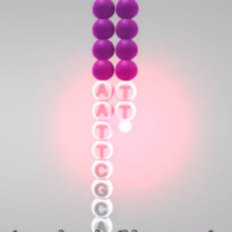

<h1 align="center">

</h1>

<div align="center">
  <a href="../README.md">English</a> | <a href="README_CN.md">中文</a> | <a href="README_ES.md">Español</a> | <a href="README_JP.md">日本語</a> | <a href="README_DE.md">Deutsch</a> | <a href="README_FR.md">Français</a>

|         |                                                                                                                                                  |
| ------- | ------------------------------------------------------------------------------------------------------------------------------------------------ |
| CI/CD   |  [![pre-commit.ci status][precommit-badge]][precommit-link]               |
| Docs    | [![Documentation Status][readthedocs-badge]][readthedocs-link] [![Preprint][preprint-badge]][preprint-link]                                            |
| Package | [![PyPI - Version][pypi-badge]][pypi-link] [![pypi download][pypi-download-badge]][pypi-download-link] [![Conda-forge badge][conda-forge-badge]][anaconda-link] [![Docker image][docker-badge]][docker-link] |
| Meta    | [![scverse-badge]][scverse-link] [![License][license-badge]][license-link]            |


[precommit-badge]: https://github.com/Starlitnightly/omicverse/workflows/py310|py311/badge.svg
[precommit-link]:https://github.com/Starlitnightly/omicverse/
[readthedocs-badge]:https://readthedocs.org/projects/omicverse/badge/?version=latest
[readthedocs-link]:https://omicverse.readthedocs.io/en/latest/?badge=latest
[preprint-badge]: https://img.shields.io/badge/DOI-10.1038/s41467.024.50194.3-368650.svg
[preprint-link]: https://doi.org/10.1038/s41467-024-50194-3
[pypi-badge]: https://img.shields.io/pypi/v/omicverse
[pypi-link]: https://pypi.org/project/omicverse
[pypi-download-badge]:https://static.pepy.tech/badge/omicverse
[pypi-download-link]:https://pepy.tech/project/omicverse
[conda-forge-badge]: https://img.shields.io/conda/dn/conda-forge/omicverse?logo=Anaconda
[anaconda-link]: https://anaconda.org/conda-forge/omicverse
[docker-badge]: https://img.shields.io/badge/docker-image-blue?logo=docker
[docker-link]: https://img.shields.io/docker/pulls/starlitnightly/omicverse
[license-badge]: https://img.shields.io/badge/license-GNU-blue
[license-link]: https://img.shields.io/apm/l/vim-mode
[scverse-badge]: https://img.shields.io/badge/scverse-ecosystem-blue.svg?labelColor=yellow
[scverse-link]: https://scverse.org/
</div>


**`OmicVerse`**는 Python을 사용한 **벌크, 단일 세포 및 공간 RNA-seq** 분석을 포함한 멀티 오믹스 분석을 위한 기본 패키지입니다. 자세한 정보는 우리의 논문을 읽어보세요: [OmicVerse: a framework for bridging and deepening insights across bulk and single-cell sequencing](https://www.nature.com/articles/s41467-024-50194-3)

> [!IMPORTANT]
>
> **별표를 주세요**, GitHub의 모든 릴리스 알림을 지연 없이 받으실 수 있습니다 ~ ⭐️
>
> **OmicVerse**가 마음에 드시고 우리의 사명을 지원하고 싶으시면, 우리의 노력을 지원하기 위해 [💗기부](https://ifdian.net/a/starlitnightly)를 고려해 주세요.

<details>
  <summary><kbd>별표 히스토리</kbd></summary>
  <picture>
    <source media="(prefers-color-scheme: dark)" srcset="https://api.star-history.com/svg?repos=Starlitnightly%2Fomicverse&theme=dark&type=Date">
    
  </picture>
</details>

## `1` [소개][docs-feat-provider]

omicverse의 원래 이름은 [Pyomic](https://pypi.org/project/Pyomic/)이었지만, 우리는 전사체학의 전체 우주를 다루고 싶어서 이름을 **`OmicVerse`**로 변경했습니다. 이는 RNA-seq의 모든 작업을 해결하는 것을 목표로 합니다.

> [!NOTE]
> OmicVerse의 **BulkTrajBlend** 알고리즘은 디컨볼루션을 위한 베타 변분 오토인코더와 겹치는 커뮤니티 발견을 위한 그래프 신경망을 결합하여 원래 scRNA-seq 데이터에서 "누락된" 세포의 연속성을 효과적으로 보간하고 복원합니다.


## `2` [디렉토리 구조](#)

````shell
.
├── omicverse                  # 메인 Python 패키지
├── omicverse_guide            # 문서 파일들
├── sample                     # 일부 테스트 데이터
├── LICENSE
└── README.md
````

## `3` [시작하기](#)

OmicVerse는 conda 또는 pypi를 통해 설치할 수 있으며 먼저 `pytorch`를 설치해야 합니다. 더 자세한 설치 단계와 다양한 플랫폼(`Windows`, `Linux` 또는 `Mac OS`)에 대한 적응은 [설치 튜토리얼](https://starlitnightly.github.io/omicverse/Installation_guild/)을 참조하세요.

설치를 위해 `conda install omicverse -c conda-forge` 또는 `pip install -U omicverse`를 사용할 수 있습니다.

[omicverse 페이지](https://starlitnightly.github.io/omicverse/) 또는 [omicverse.readthedocs.io](https://omicverse.readthedocs.io/en/latest/index.html)에서 문서와 튜토리얼을 확인하세요.

## `4` [데이터 프레임워크 및 참조](#)

omicverse는 다음 네 가지 데이터 구조를 기반으로 한 인프라로 구현됩니다.

<div align="center">
<table>
  <tr>
    <td> <a href="https://github.com/pandas-dev/pandas">pandas</a></td>
    <td> <a href="https://github.com/scverse/anndata">anndata</a></td>
    <td> <a href="https://github.com/numpy/numpy">numpy</a></td>
    <td> <a href="https://github.com/scverse/mudata">mudata</a></td>
  </tr>
</table>
</div>

---

이 표에는 게시된 도구들이 포함되어 있습니다

<div align="center">
<table>

  <tr>
    <td align="center">Scanpy<br><a href="https://github.com/scverse/scanpy">📦</a> <a href="https://link.springer.com/article/10.1186/s13059-017-1382-0">📖</a></td>
    <td align="center">dynamicTreeCut<br><a href="https://github.com/kylessmith/dynamicTreeCut">📦</a> <a href="https://academic.oup.com/bioinformatics/article/24/5/719/200751">📖</a></td>
    <td align="center">scDrug<br><a href="https://github.com/ailabstw/scDrug">📦</a> <a href="https://www.sciencedirect.com/science/article/pii/S2001037022005505">📖</a></td>
    <td align="center">MOFA<br><a href="https://github.com/bioFAM/mofapy2">📦</a> <a href="https://genomebiology.biomedcentral.com/articles/10.1186/s13059-020-02015-1">📖</a></td>
    <td align="center">COSG<br><a href="https://github.com/genecell/COSG">📦</a> <a href="https://academic.oup.com/bib/advance-article-abstract/doi/10.1093/bib/bbab579/6511197?redirectedFrom=fulltext">📖</a></td>
    <td align="center">CellphoneDB<br><a href="https://github.com/ventolab/CellphoneDB">📦</a> <a href="https://www.nature.com/articles/s41586-018-0698-6">📖</a></td>
    </tr>

  <tr>
    <td align="center">AUCell<br><a href="https://github.com/aertslab/AUCell">📦</a> <a href="https://bioconductor.org/packages/AUCell">📖</a></td>
    <td align="center">Bulk2Space<br><a href="https://github.com/ZJUFanLab/bulk2space">📦</a> <a href="https://www.nature.com/articles/s41467-022-34271-z">📖</a></td>
    <td align="center">SCSA<br><a href="https://github.com/bioinfo-ibms-pumc/SCSA">📦</a> <a href="https://doi.org/10.3389/fgene.2020.00490">📖</a></td>
    <td align="center">WGCNA<br><a href="http://www.genetics.ucla.edu/labs/horvath/CoexpressionNetwork/Rpackages/WGCNA">📦</a> <a href="https://bmcbioinformatics.biomedcentral.com/articles/10.1186/1471-2105-9-559">📖</a></td>
    <td align="center">StaVIA<br><a href="https://github.com/ShobiStassen/VIA">📦</a> <a href="https://www.nature.com/articles/s41467-021-25773-3">📖</a></td>
    <td align="center">pyDEseq2<br><a href="https://github.com/owkin/PyDESeq2">📦</a> <a href="https://www.biorxiv.org/content/10.1101/2022.12.14.520412v1">📖</a></td>
</tr>

  <tr>
    <td align="center">NOCD<br><a href="https://github.com/shchur/overlapping-community-detection">📦</a> <a href="https://arxiv.org/abs/1909.12201">📖</a></td>
    <td align="center">SIMBA<br><a href="https://github.com/pinellolab/simba">📦</a> <a href="https://www.nature.com/articles/s41592-023-01899-8">📖</a></td>
    <td align="center">GLUE<br><a href="https://github.com/gao-lab/GLUE">📦</a> <a href="https://www.nature.com/articles/s41587-022-01284-4">📖</a></td>
    <td align="center">MetaTiME<br><a href="https://github.com/yi-zhang/MetaTiME">📦</a> <a href="https://www.nature.com/articles/s41467-023-38333-8">📖</a></td>
    <td align="center">TOSICA<br><a href="https://github.com/JackieHanLab/TOSICA">📦</a> <a href="https://doi.org/10.1038/s41467-023-35923-4">📖</a></td>
    <td align="center">Harmony<br><a href="https://github.com/slowkow/harmonypy/">📦</a> <a href="https://www.nature.com/articles/s41592-019-0619-0">📖</a></td>
  </tr>

  <tr>
    <td align="center">Scanorama<br><a href="https://github.com/brianhie/scanorama">📦</a> <a href="https://www.nature.com/articles/s41587-019-0113-3">📖</a></td>
    <td align="center">Combat<br><a href="https://github.com/epigenelabs/pyComBat/">📦</a> <a href="https://doi.org/10.1101/2020.03.17.995431">📖</a></td>
    <td align="center">TAPE<br><a href="https://github.com/poseidonchan/TAPE">📦</a> <a href="https://doi.org/10.1038/s41467-022-34550-9">📖</a></td>
    <td align="center">SEACells<br><a href="https://github.com/dpeerlab/SEACells">📦</a> <a href="https://www.nature.com/articles/s41587-023-01716-9">📖</a></td>
    <td align="center">Palantir<br><a href="https://github.com/dpeerlab/Palantir">📦</a> <a href="https://doi.org/10.1038/s41587-019-0068-49">📖</a></td>
    <td align="center">STAGATE<br><a href="https://github.com/QIFEIDKN/STAGATE_pyG">📦</a> <a href="https://www.nature.com/articles/s41467-022-29439-6">📖</a></td>
  </tr>

  <tr>
    <td align="center">scVI<br><a href="https://github.com/scverse/scvi-tools">📦</a> <a href="https://doi.org/10.1038/s41587-021-01206-w">📖</a></td>
    <td align="center">MIRA<br><a href="https://github.com/cistrome/MIRA">📦</a> <a href="https://www.nature.com/articles/s41592-022-01595-z">📖</a></td>
    <td align="center">Tangram<br><a href="https://github.com/broadinstitute/Tangram/">📦</a> <a href="https://www.nature.com/articles/s41592-021-01264-7">📖</a></td>
    <td align="center">STAligner<br><a href="https://github.com/zhoux85/STAligner">📦</a> <a href="https://doi.org/10.1038/s43588-023-00528-w">📖</a></td>
    <td align="center">CEFCON<br><a href="https://github.com/WPZgithub/CEFCON">📦</a> <a href="https://www.nature.com/articles/s41467-023-44103-3">📖</a></td>
    <td align="center">PyComplexHeatmap<br><a href="https://github.com/DingWB/PyComplexHeatmap">📦</a> <a href="https://doi.org/10.1002/imt2.115">📖</a></td>
      </tr>

  <tr>
    <td align="center">STT<br><a href="https://github.com/cliffzhou92/STT/">📦</a> <a href="https://www.nature.com/articles/s41592-024-02266-x#Sec2">📖</a></td>
    <td align="center">SLAT<br><a href="https://github.com/gao-lab/SLAT">📦</a> <a href="https://www.nature.com/articles/s41467-023-43105-5">📖</a></td>
    <td align="center">GPTCelltype<br><a href="https://github.com/Winnie09/GPTCelltype">📦</a> <a href="https://www.nature.com/articles/s41592-024-02235-4">📖</a></td>
    <td align="center">PROST<br><a href="https://github.com/Tang-Lab-super/PROST">📦</a> <a href="https://doi.org/10.1038/s41467-024-44835-w">📖</a></td>
    <td align="center">CytoTrace2<br><a href="https://github.com/digitalcytometry/cytotrace2">📦</a> <a href="https://doi.org/10.1101/2024.03.19.585637">📖</a></td>
    <td align="center">GraphST<br><a href="https://github.com/JinmiaoChenLab/GraphST">📦</a> <a href="https://www.nature.com/articles/s41467-023-36796-3#citeas">📖</a></td>
  </tr>

  <tr>
    <td align="center">COMPOSITE<br><a href="https://github.com/CHPGenetics/COMPOSITE/">📦</a> <a href="https://www.nature.com/articles/s41467-024-49448-x#Abs1">📖</a></td>
    <td align="center">mellon<br><a href="https://github.com/settylab/mellon">📦</a> <a href="https://www.nature.com/articles/s41592-024-02302-w">📖</a></td>
    <td align="center">starfysh<br><a href="https://github.com/azizilab/starfysh">📦</a> <a href="http://dx.doi.org/10.1038/s41587-024-02173-8">📖</a></td>
    <td align="center">COMMOT<br><a href="https://github.com/zcang/COMMOT">📦</a> <a href="https://www.nature.com/articles/s41592-022-01728-4">📖</a></td>
    <td align="center">flowsig<br><a href="https://github.com/axelalmet/flowsig">📦</a> <a href="https://doi.org/10.1038/s41592-024-02380-w">📖</a></td>
    <td align="center">pyWGCNA<br><a href="https://github.com/mortazavilab/PyWGCNA">📦</a> <a href="https://doi.org/10.1093/bioinformatics/btad415">📖</a></td>
  </tr>

  <tr>
    <td align="center">CAST<br><a href="https://github.com/wanglab-broad/CAST">📦</a> <a href="https://www.nature.com/articles/s41592-024-02410-7">📖</a></td>
    <td align="center">scMulan<br><a href="https://github.com/SuperBianC/scMulan">📦</a> <a href="https://link.springer.com/chapter/10.1007/978-1-0716-3989-4_57">📖</a></td>
    <td align="center">cellANOVA<br><a href="https://github.com/Janezjz/cellanova">📦</a> <a href="https://www.nature.com/articles/s41587-024-02463-1">📖</a></td>
    <td align="center">BINARY<br><a href="https://github.com/senlin-lin/BINARY/">📦</a> <a href="https://www.sciencedirect.com/science/article/pii/S2666979X24001319">📖</a></td>
    <td align="center">GASTON<br><a href="https://github.com/raphael-group/GASTON">📦</a> <a href="https://www.nature.com/articles/s41592-024-02503-3">📖</a></td>
    <td align="center">pertpy<br><a href="https://github.com/scverse/pertpy">📦</a> <a href="https://www.biorxiv.org/content/early/2024/08/07/2024.08.04.606516">📖</a></td>
  </tr>

  <tr>
    <td align="center">inmoose<br><a href="https://github.com/epigenelabs/inmoose">📦</a> <a href="https://www.nature.com/articles/s41598-025-03376-y">📖</a></td>
    <td align="center">memento<br><a href="https://github.com/yelabucsf/scrna-parameter-estimation">📦</a> <a href="https://www.cell.com/cell/fulltext/S0092-8674(24)01144-9">📖</a></td>
    <td align="center">GSEApy<br><a href="https://github.com/zqfang/GSEApy">📦</a> <a href="https://academic.oup.com/bioinformatics/article-abstract/39/1/btac757/6847088">📖</a></td>
    <td align="center">marsilea<br><a href="https://github.com/Marsilea-viz/marsilea/">📦</a> <a href="https://genomebiology.biomedcentral.com/articles/10.1186/s13059-024-03469-3">📖</a></td>
    <td align="center">scICE<br><a href="https://github.com/Mathbiomed/scICE">📦</a> <a href="https://www.nature.com/articles/s41467-025-60702-8">📖</a></td>
    <td align="center">sude<br><a href="https://github.com/ZPGuiGroupWhu/sude">📦</a> <a href="https://www.nature.com/articles/s42256-025-01112-9">📖</a></td>
  </tr>

  <tr>
    <td align="center">GeneFromer<br><a href="https://huggingface.co/ctheodoris/Geneformer">📦</a> <a href="https://www.nature.com/articles/s41586-023-06139-9">📖</a></td>
    <td align="center">scGPT<br><a href="https://github.com/bowang-lab/scGPT">📦</a> <a href="https://www.nature.com/articles/s41592-024-02201-0">📖</a></td>
    <td align="center">scFoundation<br><a href="https://github.com/biomap-research/scFoundation">📦</a> <a href="https://www.nature.com/articles/s41592-024-02305-7">📖</a></td>
    <td align="center">UCE<br><a href="https://github.com/snap-stanford/UCE">📦</a> <a href="https://www.biorxiv.org/content/10.1101/2023.11.28.568918v1.full.pdf">📖</a></td>
    <td align="center">CellPLM<br><a href="https://github.com/OmicsML/CellPLM">📦</a> <a href="https://www.biorxiv.org/content/10.1101/2023.10.03.560734v1">📖</a></td>
    <td align="center">kb_python<br><a href="https://github.com/pachterlab/kb_python">📦</a> <a href="https://doi.org/10.1038/s41596-024-01057-0">📖</a></td>

  </tr>

  <tr>
    <td align="center">Scaden<br><a href="https://github.com/KevinMenden/scaden">📦</a> <a href="https://www.science.org/doi/10.1126/sciadv.aba2619">📖</a></td>
    <td align="center">BayesPrime<br><a href="https://github.com/Danko-Lab/BayesPrism">📦</a> <a href="https://github.com/ziluwang829/pyBayesPrism">📦</a> <a href="https://www.nature.com/articles/s43018-022-00356-3">📖</a></td>
    <td align="center">InstaPrime<br><a href="https://github.com/humengying0907/InstaPrism">📦</a> <a href="https://academic.oup.com/bioinformatics/article/40/7/btae440/7708397">📖</a></td>
    <td align="center">Cellpytist<br><a href="https://github.com/Teichlab/celltypist">📦</a> <a href="https://www.science.org/doi/10.1126/science.abl5197">📖</a></td>
    <td align="center">latentvelo<br><a href="https://github.com/Spencerfar/LatentVelo">📦</a> <a href="https://www.cell.com/cell-reports-methods/fulltext/S2667-2375(23)00225-4">📖</a></td>
    <td align="center">graphvelo<br><a href="https://github.com/xing-lab-pitt/GraphVelo">📦</a> <a href="https://www.nature.com/articles/s41467-025-62784-w">📖</a></td>

  </tr>

  <tr>
    <td align="center">scvelo<br><a href="https://github.com/theislab/scvelo">📦</a> <a href="http://dx.doi.org/10.1038/s41587-020-0591-3">📖</a></td>
    <td align="center">Dyanmo<br><a href="https://github.com/aristoteleo/dynamo-release">📦</a> <a href="https://www.sciencedirect.com/science/article/pii/S0092867421015774">📖</a></td>

  </tr>
</table>
</div>

---

**포함된 패키지가 게시되지 않았거나 프리프린트**

- [1] [Cellula](https://github.com/andrecossa5/Cellula/)는 scRNA-seq 탐색을 위한 도구 키트를 제공합니다. 이러한 도구들은 일반적인 단일 세포 분석 작업을 수행합니다
- [2] [pegasus](https://github.com/lilab-bcb/pegasus/)는 수백만 개의 단일 세포의 전사체를 분석하는 도구입니다. 이는 명령줄 도구, python 패키지 및 클라우드 기반 분석 워크플로우의 기반입니다.
- [3] [cNMF](https://github.com/dylkot/cNMF)는 단일 세포 RNA-Seq (scRNA-Seq) 데이터에서 유전자 발현 프로그램을 추론하기 위한 분석 파이프라인입니다.

## `5` [연락처](#)

- Zehua Zeng ([starlitnightly@gmail.com](mailto:starlitnightly@gmail.com) 또는 [zehuazeng@xs.ustb.edu.cn](mailto:zehuazeng@xs.ustb.edu.cn))
- Lei Hu ([hulei@westlake.edu.cn](mailto:hulei@westlake.edu.cn))

## `6` [개발자 가이드 및 기여](#)

omicverse에 기여하고 싶으시면, [개발자 문서](https://omicverse.readthedocs.io/en/latest/Developer_guild/)를 참조하세요.

<table align="center">
    <tr>
      <th colspan="2">
        <br><br><br>
      </th>
    </tr>
</table>

> [!IMPORTANT]  
> Omicverse를 홍보해주신 다음 WeChat 공식 계정들에게 감사드립니다.
> <p align="center"> <a href="https://mp.weixin.qq.com/s/egAnRfr3etccU_RsN-zIlg" target="_blank" rel="noreferrer">  </a> <a href="https://zhuanlan.zhihu.com/c_1257815636945915904?page=3" target="_blank" rel="noreferrer">  </a> </p>

## `7` [인용](https://doi.org/10.1038/s41467-024-50194-3)

작업에서 `omicverse`를 사용하시면, 다음과 같이 `omicverse` 발행물을 인용해 주세요:

> **OmicVerse: a framework for bridging and deepening insights across bulk and single-cell sequencing**
>
> Zeng, Z., Ma, Y., Hu, L. et al.
>
> _Nature Communication_ 2024년 7월 16일. doi: [10.1038/s41467-024-50194-3](https://doi.org/10.1038/s41467-024-50194-3).

다른 관련 패키지들도 있습니다. 사용하시면 언제든지 참조해 주세요!

> **CellOntologyMapper: Consensus mapping of cell type annotation**
>
> Zeng, Z., Wang, X., Du, H.
>
> _bioRxiv_ 2025년 6월 20일. doi: [10.1101/2025.06.10.658951](https://doi.org/10.1101/2025.06.10.658951).

## `8` [기타](#)

우리 프로젝트의 개발을 후원하고 싶으시면, afdian 웹사이트(https://ifdian.net/a/starlitnightly)로 가서 후원해 주세요.

Copyright © 2024 [112 Lab](https://112lab.asia/). <br />
이 프로젝트는 [GPL3.0](../LICENSE) 라이센스를 따릅니다.

<!-- LINK GROUP -->
[docs-feat-provider]: https://starlitnightly.github.io/omicverse/ 