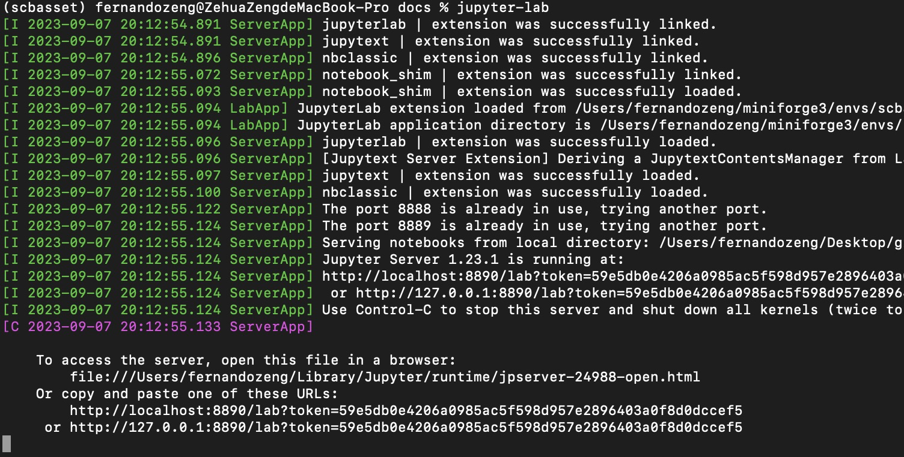

# OmicVerse Installation Guide

## Prerequisites

OmicVerse can be installed via conda or pip, but you need to install `PyTorch` first.

!!! note 
    To avoid potential dependency conflicts, it is recommended to install within a `conda` environment. Use `pip install -U omicverse` to update.

### Platform-Specific Instructions

Installation methods vary depending on the platform:

- **Windows-WSL**: Install the [WSL subsystem](https://learn.microsoft.com/en-us/windows/wsl/install) and `conda` within WSL to configure the OmicVerse environment.
- **Windows-Native**: From version `1.6.2`, OmicVerse supports native Windows, but you need to install `torch`, `torch_geometric`, and `python-annoy` first.
- **Linux**: Install [Anaconda](https://www.anaconda.com/) or [Miniconda](https://docs.conda.io/en/latest/miniconda.html) and use conda to configure the OmicVerse environment.
- **Mac OS**: Use [`miniforge`](https://github.com/conda-forge/miniforge) or [`mambaforge`](https://www.rho-signal-effective-analytics.com/modules/pre-course/miniconda-installation/) to configure the environment.

### pip Prerequisites
- If using conda/mamba, run `conda install -c anaconda pip` and skip this section.
- Install Python, preferably using the pyenv version management system along with pyenv-virtualenv.

### Apple Silicon Prerequisites
Installing OmicVerse on a Mac with Apple Silicon is only possible using a native version of Python. You can install a native version of Python with an Apple Silicon version of mambaforge (installable via a native version of Homebrew using `brew install --cask mambaforge`).

## Detailed Installation Steps

### Using Conda

1. **Install conda**: Typically, use the `mambaforge` distribution.

2. **Create a new conda environment**:

    ```shell
    conda create -n omicverse python=3.10
    ```

3. **Activate your environment**:

    ```shell
    conda activate omicverse
    ```

4. **Install PyTorch and PyG**:

    - First, determine your CUDA version (if applicable):

        ```shell
        nvcc --version
        ```

    - Install the appropriate version of PyTorch:

        ```shell
        conda install pytorch torchvision torchaudio pytorch-cuda=11.8 -c pytorch -c nvidia
        ```

        If using CPU only:

        ```shell
        conda install pytorch torchvision torchaudio cpuonly -c pytorch
        ```

    - Install PyG:

        ```shell
        conda install pyg -c pyg
        ```

5. **Install OmicVerse**:

    ```shell
    conda install python-annoy -c conda-forge
    conda install omicverse -c conda-forge
    ```

6. **Verify the installation**:

    ```shell
    python -c "import omicverse"
    ```

    If no errors appear, the installation was successful.

### Using pip

1. **Install PyTorch**:

    ```shell
    pip3 install torch torchvision torchaudio --index-url https://download.pytorch.org/whl/cu118
    ```

    If using CPU only:

    ```shell
    pip3 install torch torchvision torchaudio --index-url https://download.pytorch.org/whl/cpu
    ```

2. **Install PyG**:

    - First, check your local CUDA version and PyTorch version:

        ```shell
        python -c "import torch; print(torch.__version__)"
        python -c "import torch; print(torch.version.cuda)"
        ```

    - Install the appropriate PyG version based on your CUDA and PyTorch versions:

        ```shell
        pip install torch_geometric
        ```

        Install the relevant packages:
        ```shell
        pip install pyg_lib torch_scatter torch_sparse torch_cluster torch_spline_conv -f https://data.pyg.org/whl/torch-${TORCH}+${CUDA}.html
        ```
        ---

        where `${TORCH}` and `${CUDA}` should be replaced by the specific PyTorch and CUDA versions, respectively:
        
         <ul>
        <li>PyTorch 2.3: ${TORCH}=2.3.0 and ${CUDA}=cpu|cu118|cu121</li>
        <li>PyTorch 2.2: ${TORCH}=2.2.0 and ${CUDA}=cpu|cu118|cu121</li>
        <li>PyTorch 2.1: ${TORCH}=2.1.0 and ${CUDA}=cpu|cu118|cu121</li>
        <li>PyTorch 2.0: ${TORCH}=2.0.0 and ${CUDA}=cpu|cu117|cu118</li>
        <li>PyTorch 1.13: ${TORCH}=1.13.0 and ${CUDA}=cpu|cu116|cu117</li>
         </ul>

        ---
        For example, for PyTorch 2.3.* and CUDA 12.1, type:
        
        ```shell
        pip install pyg_lib torch_scatter torch_sparse torch_cluster torch_spline_conv -f https://data.pyg.org/whl/torch-2.3.0+cu121.html
        ```

        For example, for PyTorch 2.2.* and CUDA 11.8, type:
        ```shell
        pip install pyg_lib torch_scatter torch_sparse torch_cluster torch_spline_conv -f https://data.pyg.org/whl/torch-2.2.0+cu118.html
        ```

        More information could be found in documention of [PyG](https://pytorch-geometric.readthedocs.io/en/latest/install/installation.html)

        ---


3. **Configure Annoy (Windows Native only)**:

    ```shell
    conda install python-annoy -c conda-forge
    ``` 

4. **Configure GCC (Linux only)**:

    - For Ubuntu:

        ```shell
        sudo apt update
        sudo apt install build-essential
        ```

    - For CentOS:

        ```shell
        sudo yum group install "Development Tools"
        ```

    - Verify GCC installation:

        ```shell
        gcc --version
        ```

5. **Install OmicVerse and Numba**:

    ```shell
    pip install -U omicverse
    pip install -U numba
    ```

6. **Verify the installation**:

    ```shell
    python -c "import omicverse"
    ```

    If no errors appear, the installation was successful.

### Nightly Version

If you want to use the nightly version of OmicVerse:

1. **Clone the repository**:

    ```shell
    git clone https://github.com/Starlitnightly/omicverse.git
    ```

2. **Install OmicVerse**:

    ```shell
    pip install .
    ```

    Alternatively, you can install directly from GitHub:

    ```shell
    pip install git+https://github.com/Starlitnightly/omicverse.git
    ```

### Additional Notes

If you encounter errors with pip, for packages that pip can't install (e.g., scikit-misc), use conda:

```shell
conda install scikit-misc -c conda-forge -c bioconda
```

For M1/M2 silicon users, the following commands may help:

```shell
# Python 3.9
conda install s_gd2 -c conda-forge
pip install -U omicverse
conda install pytorch::pytorch torchvision torchaudio -c pytorch
```

## GPU-Accelerated Installation

To install `rapids-singlecell` and `omicverse` with GPU acceleration, use the provided `yaml` file:

```shell
conda env create -f conda/omicverse_gpu.yml
# or
mamba env create -f conda/omicverse_gpu.yml
```


## Jupyter-lab

For the best interactive analysis experience, we highly recommend installing jupyter-lab so that you can interactively edit the code and get the analysis results and visualizations right away.

```shell
pip install jupyter-lab
```

After you have finished the installation, in your terminal (note that you must be in the omicverse environment, not the base environment), type `jupyter-lab`, a URL will appear, we can open this URL in the browser to start our analysis journey!




## Development

For development - clone this repo and run:

```shell
pip install -e ".[dev,docs]"
```

